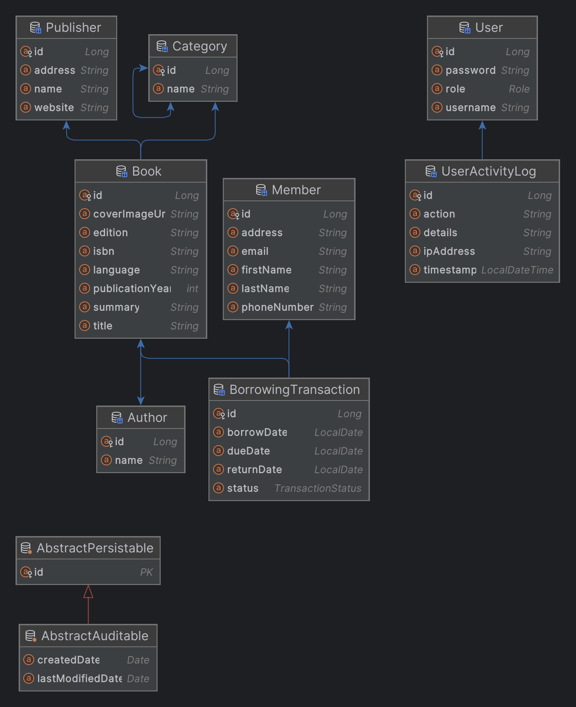

# Tharaa Library Management System 📚

Tharaa Library Management System is a Spring Boot--based application
designed to manage the operations of a library.\
It provides functionality for managing books, authors, members,
borrowing transactions, users with roles, and activity logs.

------------------------------------------------------------------------

## Features ✨

-   User Authentication & Role-based Access (Admin, Librarian, Staff).
-   Manage Books, Authors, Categories, and Publishers.
-   Member Management.
-   Borrowing & Returning Transactions with due dates.
-   User Activity Logging.
-   Secure Passwords with BCrypt Hashing.
-   PostgreSQL Integration.
-   Spring Security with JWT.

------------------------------------------------------------------------

## Tech Stack 🛠️

-   **Java 17**
-   **Spring Boot 3**
-   **Spring Security + JWT**
-   **Spring Data JPA (Hibernate)**
-   **PostgreSQL**
-   **Maven**
-   **Lombok**

------------------------------------------------------------------------

## Database Schema (ERD) 🗄️

The following diagram represents the database schema of the project:



------------------------------------------------------------------------

## Installation 🚀

### Prerequisites

-   Java 17+
-   Maven
-   PostgreSQL

### Steps

1.  Clone the repository:

    ``` bash
    git clone https://github.com/merna-elsherief/Tharaa-Library-Management-System.git
    cd Tharaa-Library-Management-System
    ```

2.  Update the database configuration in `application.properties`:

    ``` properties
    spring.datasource.url=jdbc:postgresql://localhost:5432/tharaa_db
    spring.datasource.username=your_db_user
    spring.datasource.password=your_db_password
    ```

3.  Build and run the project:

    ``` bash
    mvn spring-boot:run
    ```

4.  The application will be available at:\
    <http://localhost:8080>

------------------------------------------------------------------------

## Default Users 👤

Username     Password   Role
  ------------ ---------- -----------
"admin1"       "admin123"   ADMIN
"librarian1"   "lib123"     LIBRARIAN
"staff1"       "staff123"   STAFF

*(Passwords are stored as BCrypt hashes in the database)*

## Postman Collection

You can test the API endpoints using Postman with the following collection:

[Tharaa.postman_collection.json](postman/Tharaa.postman_collection.json)

### How to use the Postman Collection:
1. Open Postman.
2. Click on **Import → File**.
3. Select `postman/Tharaa.postman_collection.json`.
4. Now you can run and test all API endpoints easily.

## 📌 Future Improvements
- Password reset via email/OTP
- Refresh tokens for better authentication
- Swagger/OpenAPI documentation
- Dockerize application
- Unit & integration tests

---

## 👩‍💻 Author
**Merna Elsherief**
- 📧 [merna.m.elsherief@gmail.com]
- 💼 [https://www.linkedin.com/in/merna-elsherief]
- 🐙 [https://github.com/merna-elsherief]

------------------------------------------------------------------------

## License 📄

This project is licensed under the MIT License.

